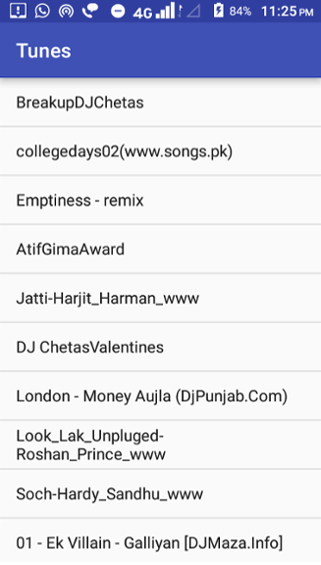

# Music-Player-Tunes
This is a Music player which lists all the songs from the External storage and plays the selected song. This implementation requires the use of MediaPlayer API which is the primary API for playing audio. 

